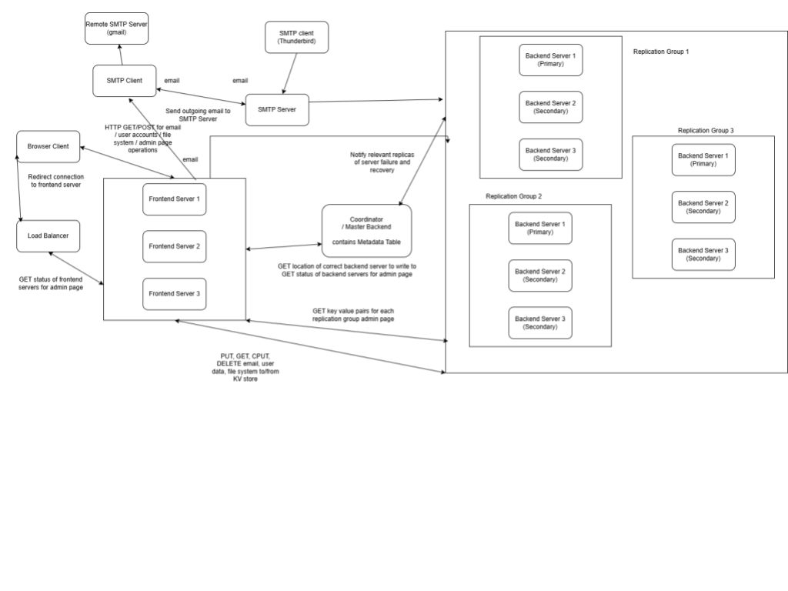
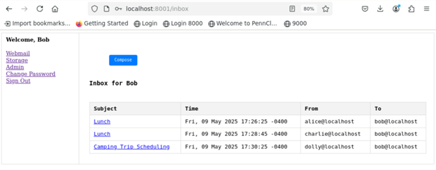
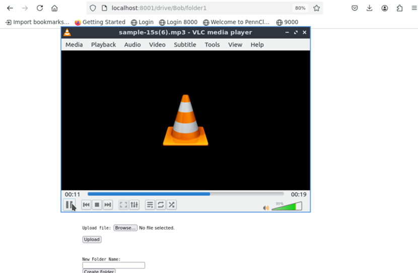
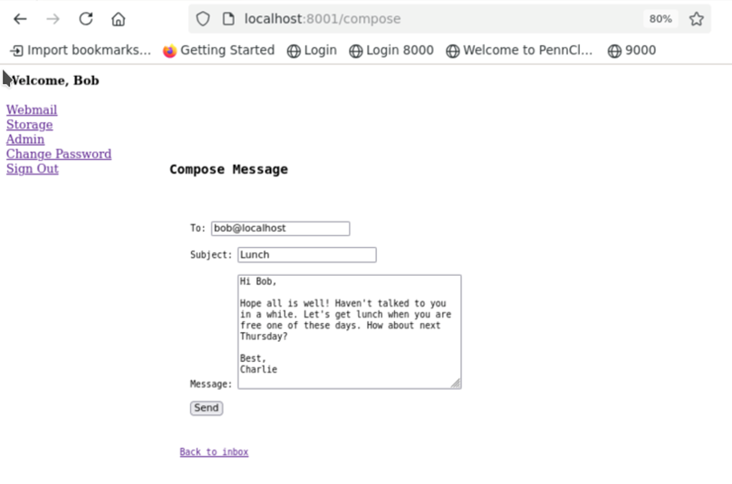
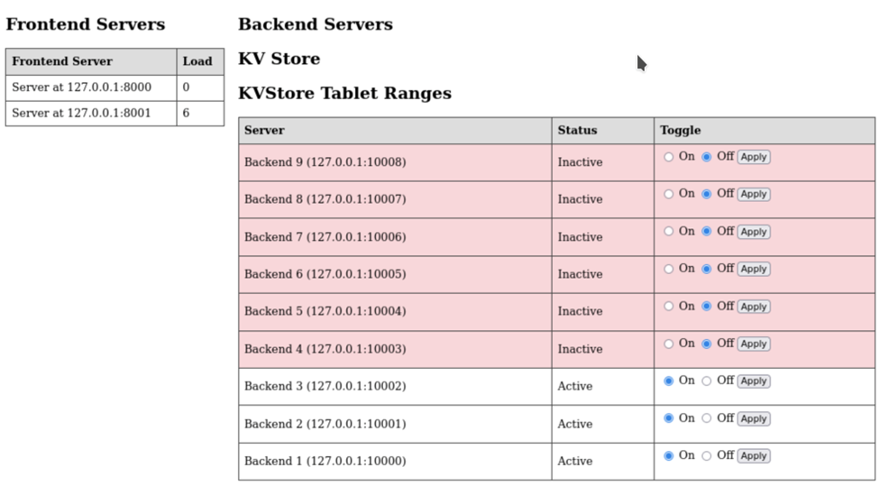

# PennCloud: A Distributed, Fault-Tolerant Key-Value Store

**PennCloud** is a robust, highly available distributed key-value store implemented in C++. Designed as a foundational cloud service, it supports applications like email and file storage, demonstrating advanced concepts in distributed systems, replication, consistency, and recovery.

## System Architecture

PennCloud features a three-tier distributed architecture for scalability and resilience:

*   **Frontend Load Balancer (Port 9000):** Entry point for users, distributing requests to Frontend Servers using round-robin. Stateless design redirects clients for direct FE communication.
*   **Frontend Servers (Ports 8000-8002):** Multi-threaded, stateless servers providing user services (email, file storage, user accounts). Parse HTTP requests and interact with the Backend.
*   **Backend Servers (Ports 10000-10008):** Core key-value store nodes, managing data "tablets." Ensure fault tolerance, primary-based replication, and strong consistency through multi-threaded operations.
*   **BE Coordinator (Port 9999):** Central authority monitoring Backend Servers, managing primary elections, directing clients to active backend nodes, and orchestrating shutdowns/recoveries.

**Architecture Overview:**

_Figure 1: PennCloud System Architecture Overview, detailing component interactions and data flow across Frontend Load Balancers, Frontend Servers, Backend Servers, and Coordinator._

## Key Features

*   **Distributed Key-Value Store:** Data partitioned into "tablets," replicated across multiple Backend Servers (primary/secondary) for fault tolerance and high availability.
*   **Sequential Consistency:** Achieved via row-level locking and strict primary-based replication, ensuring data integrity and ordered operations.
*   **Robust Fault Tolerance & Recovery:** Automatic primary failover, consistent checkpointing, and detailed logging enable fast, minimal-loss recovery from various node failures.

**Fault Tolerance & Recovery Demo:**

**[Watch the Demo on Vimeo](https://vimeo.com/1105258845?share=copy)**

_Video 1: Watch a demonstration of PennCloud's robust fault tolerance and recovery mechanisms in action, showing how the system maintains availability during node failures and seamlessly recovers data._

*   **Comprehensive User Services:**
    *   **File Storage System:** Supports uploading and downloading various file types, chunked transfers, and nested folders.

    
    
    _Figure 2: Showcasing the successful upload and rendering of a high-resolution image file within the PennCloud file storage system._

    

    _Figure 3: Demonstrating the ability to upload and play audio files directly from the PennCloud storage, highlighting robust file handling capabilities._

    *   **Email System (Webmail):** Full webmail functionality, including viewing inbox, reading email contents, replying, deleting, and sending emails to both local and external addresses (via SMTP client).

    

    _Figure 4: The user-friendly interface for composing and sending emails within the PennCloud webmail system._

    

    _Figure 5: A view of the PennCloud webmail inbox, displaying received emails in a clear and concise format._

*   **User Account Management:** Secure sign-up, login, password changes, and cookie-based sessions.
*   **Real-time Admin Console:** Monitors server status, tablet ranges, and allows for remote server management (shutdown/restart).

_Figure 6: The Admin Console dashboard providing real-time visibility into the status and load of Frontend and Backend servers, along with their assigned key-value store tablet ranges._

*   **Extensive API:** Custom communication protocols for all inter-component interactions (FE-BE, FE-Coordinator, BE-BE).

## Challenges & Solutions

Developing PennCloud involved overcoming complex distributed system challenges:

*   **Socket Management & Stability:** Addressed persistent connection closures and resource leaks with rigorous error checking, heartbeat mechanisms, and systematic connection retries.
*   **Mutual Exclusion & Data Safety:** Implemented careful mutex application and continuous code refinement to ensure thread safety and prevent deadlocks within the key-value store.
*   **Frontend-Backend Integration:** Overcame complex API mismatches and critical routing issues (e.g., redirecting to dead nodes) through iterative development and precise status checks.
*   **Primary Failover & Consistency:** Developed a robust heartbeat-based failure detector and reconnection strategy to manage conflicting leadership claims and ensure consistency during primary node transitions.
*   **Reliable Remote Write Protocol:** Mitigated latency and lost acknowledgments in multi-hop write propagation to ensure consistent data across all replicas.
*   **Complex Recovery Implementation:** Built a sophisticated recovery protocol involving checkpoint versioning, chunked data transfers, and intelligent log replay for fast, durable system restoration.

## Technologies Used

*   **C++:** Core implementation language for the entire backend system.
*   **Sockets API:** Low-level network communication for inter-node and client-server interactions.
*   **Pthreads:** For efficient multi-threading, enabling concurrent client connections and background tasks.
*   **Makefiles:** For streamlined compilation and project management.